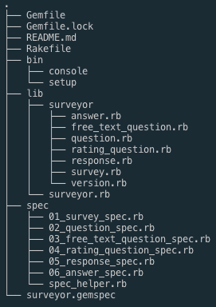
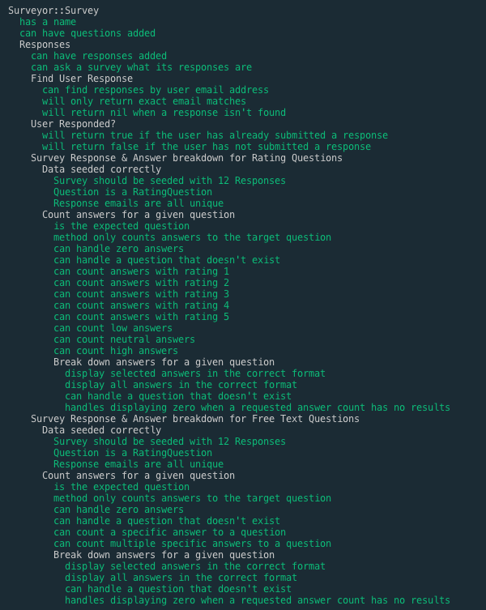
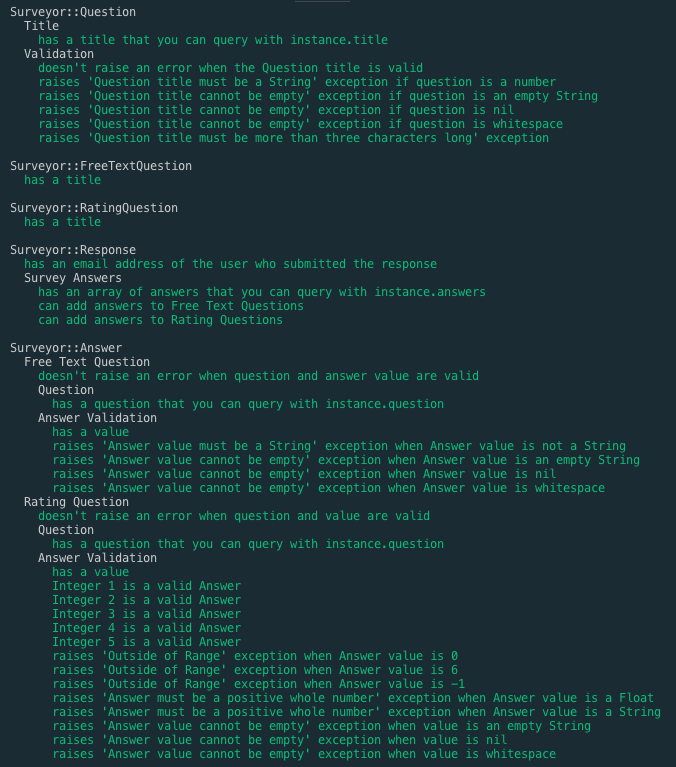
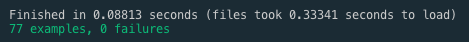

# Surveyor - 2018 Culture Amp Junior Engineering Coding Test

## About
This is the 2018 technical challenge given to applicants to Culture Amp's Junior Engineering Program. 
I did this challenge in conjuction with the Toy Robot book (https://leanpub.com/toyrobot/) to learn testing in Ruby, in particular the RSpec Testing Suite. 

The challenge consisted of coding and writing tests for 'Surveyor', a CLI-based Ruby Gem that represents and validates survey data in Ruby. 

You are given a starter Gem with some boilerplate classes, a couple of beginner tests, and asked to build specific functionality coupled with tests that ensure the gem works as expected. 

## Setup

To download this application to your computer, navigate to the directory you want to use on your computer and run `git clone https://github.com/JoshTeperman/cultureamp-surveyor-2.git`. This should install the files locally. You can then `cd cultureamp-surveyor-2` to open the application directory. 

Alternatively, you can download the code directly to your hard-drive: https://github.com/JoshTeperman/cultureamp-surveyor-2/archive/master.zip

To run this application, you will first need to have Ruby 2.5.1 installed on your machine. 

Installation instructions here: https://www.ruby-lang.org/en/documentation/installation/

You will also need Bundler installed:
```
gem install bundler
```
Once you have Ruby + Bundler installed, you can install the gem dependencies with this command:
```
bundle install
```
You can verify that the code matches the Ruby Style Guide and what's configured in `.rubocop.yml` by running:
```
bundle exec rubocop
```
To view the tests and see if anything is failing run `bundle exec rspec` and you should see the full test suite and a summary of the results of the tests. 

# App Description 

## Functionality: 

`Survey` Class 
- Has a `:name`, a list of `:questions` and `:responses` to those `:questions`:
- Ask a `Survey` what its `:responses` are.
- Add `Questions` and `Responses` to the `Survey`.
- Search for the `Response` from a particular user by email address
- Check if a user has already responded.
- Search for and retrieve `Answers` to a `Question` based on the `Question` and `Answer` value. 
- Return (and count) the low, neutral or high value `Answers` to `Rating Questions`.
- Return a list of all the `Answers` to a `Question` and tally the total number of each `Answer`. Do the same for one or more specific `Answers` to a specific `Question`. 


`Question` Class and its subclasses `FreeTextQuestion` & `RatingQuestion`
- `Question` is a superclass to all other `Question` classes that inherit from it.
- Each subclass has it's own `Answer` validation method that can be customised, and is called when a new `Answer` is created. 
- `FreeTextQuestion` subclass allows any type of `Answer` as long as it is a String with some basic limitations.
- `RatingQestion` subclass allows the `Answers` 1 - 5.
- Can create new types of `Question` subclasses as required. 

`Response` Class
- Each `Response` contains all of the `:answers` to a Survey from one person, identified by an `:email` address. 
- You can add `Answers` to a `Response` and ask a `Response` what its `Answers` are.

`Answer` Class
- Has a `:question` attribute which is an instance of one of the `:Question` subclasses. Therefore an `Answer` only knows what its `Question` is.
- Contains the `Answer :value`, which is the response from the user.
- It is not possible to create an `Answer` without specifying what it's `Question` is.
- Included on a `Response` to track what a person's `:answers` to a `Survey`. Therefore an `Answer` is linked to a `Response`, but not directly to a `Survey`.

### File Structure



## Design Decisions:

### Finding `Answers` to a given `Question`

The challenge instructions were to create a method that would count the number of high, neutral, and low `Answers` to the `Rating Question`, and then create another method that would display the total `Answers` for each value in a readable format. 

I initially wrote a method that would do exactly that, but decided to extend the code to flexibly allow for a search of any `Answer` value for a given `Question`:

```
~/lib/surveyor/survey.rb

def fetch_answers(target_question, *args)
  return "That question doesn't exist" unless @questions.include?(target_question)

  answers = []
  @responses.each do |response|
    response.answers.each do |answer|
      if args.length.zero?
        answers.push(answer)
      elsif answer.question == target_question &&
            args.include?(answer.value)
        answers.push(answer)
      end
    end
  end
  answers
end
```
The above method takes an instance of a `Question` Subclass as it's first argument, which in this challenge can be either `Surveyor::FreeTextQuestion` or `Surveyor::RatingQuestion`, but is intended to be useable with any future definition of a `Question` subclass. 

The second argument `*args` allows a search for any number of `Answer` values, and the method will return an array of all of the `Answers` that match that value for the given `Question`. 

If no `Answers` are specified in the second argument, the method will skip the `Answer` value validation check, and it will return every `Answer` for the `Question`.  

I chose to return an array of `Answer` objects rather than the total number of `Answers`. I thought this was a more extendable option as it still allows us to count `Answers` by calling `.length` on the result of the method call, but in addition should allow for different features based off this data: for example you could add customer / respondent ID to the `Answer` object, giving you access to customer information etc etc, or add other variables that would allow for data analytics, all of which won't be possible if the method only returns the number of `Responses`. 


This method gives us a baseline to flexibly search for different types of data: For example:

Find all `Answers`: 
```
  fetch_answers(question)
```
Find all low `Answers` (value 1 or 2), to be used with `Rating Questions`:
```
  def fetch_low_answers(question)
    fetch_answers(question, 1, 2)
  end
```
Find `Answers` with value 3 or 4:
```
  fetch_answers(question, 3, 4)
```
Find `Answers` with a mixed group of values: 
```
  fetch_answers(question, 'Yes', 'No', 'Barbecue', 'something something something', 2, 100)
```

This method will be useable with any combination of `Question` types and validations, and can be coupled with tests and `Question` validations written ensure the `Responses` are returning expected results. 

### Display `Answers` for a given `Question`

The challenge required a method that would break down the `Responses` for a question by `Answer` value, and display the totals in a readable format. For example:

```
answers = [1, 1, 2, 3, 3]
```
would return:

```
1: 2
2: 1
3: 2
```

I used the `fetch_answers(target_question, *args)` method from earlier to retrieve the data, and wrote a new method that would format and display the results:

```
~/lib/surveyor/survey.rb

def display_answers(target_question, *args)
  return "That question doesn't exist" unless @questions.include?(target_question)

  results = {}
  survey_answers = fetch_answers(target_question, *args).map(&:value)
  if args.length.zero?
    survey_answers.each do |answer|
      results[answer] = survey_answers.count(answer)
    end
  else
    args.each do |target_answer|
      results[target_answer] = survey_answers.count(target_answer)
    end
  end
  formatted_results = results.map do |answer, total|
    ["#{answer}: #{total}"]
  end
  formatted_results.join("\n")
end
```

The method works in a similar way to the `fetch_answers` solution in that it takes an optional `*args` argument which allows a flexible search for different `Answer` values. Once again you can search for any combination of `Question` subclasses or `Answer` value types, as long as you configure the validations and tests as a safety net, and can be used to return all `Answers` using an additional method:

```
~/lib/surveyor/survey.rb

def display_all_answers(target_question)
  display_answers(target_question)
end
```
Similarly to the `fetch_answers` method, when `*args` isn't specified, `*args.length` evaluates to zero and is caught by the `if` statement, which in turn counts all `Answers` for the target `Question`. 

Examples:

```
~/spec/01_survey_spec.rb

answers = [
          'aaaa',
          'aaaa',
          'aaaa',
          'bbbb',
          'cccc',
          'cccc',
          'dddd',
          'dddd',
          'eeee',
          'eeee',
          'eeee',
          'eeee',
        ]

it 'can count multiple specific answers to a question' do
  expect(subject.fetch_answers(@sample_question, 'aaaa', 'bbbb').length).to eq(4)
end

...

it 'display all answers in the correct format' do
  expect(subject.display_all_answers(@sample_question)).to eq("aaaa: 3\nbbbb: 1\ncccc: 2\ndddd: 2\neeee: 4")
end

...

it 'handles displaying zero when a requested answer count has no results' do
  question = Surveyor::FreeTextQuestion.new(title: 'Test Question')
  answer = Surveyor::Answer.new(question: question, value: 'Test Answer')
  response = Surveyor::Response.new(email: "test@gmail.com")
  response.add_answer(answer)
  subject.add_response(response)
  subject.add_question(question)
  expect(subject.display_answers(question, 'Another Test Answer')).to eq("Another Test Answer: 0")
end
```

## Testing

I closely followed the approach laid out in the Toy Robot book by Ryan Biggs, which adheres to the principles of Test Driven Development, and the Traffic Light method:

- Red: Write a test and make sure it fails
- Amber: Make the test pass in any way you can
- Green: Refactor the code if necessary

At the time of writing this all 77 tests are passing. Fingers crossed it stays that way :)






### Test Structure

Tests are written for each individual class. There are happy path and unhappy path tests for each class that confirm the behaviour of classes and the expected results of calling certain functions, as well as tests to confirm the right classes, data, and objects are being called. 

All test files begin by initializing a version of the class to be tested:
```
RSpec.describe Surveyor::Survey do
  subject { described_class.new(name: 'Engagement Survey') }
```
... which allows me to run tests against `subject`, which in this case is an instance of the `Survey` Class:
```
it 'has a name' do
  expect(subject.name).to eq('Engagement Survey')
end
```

Each individual test file then tests different behaviour or pieces of the class, separated into `describe` blocks: 
```
describe 'Responses' do
  responses = [
    Surveyor::Response.new(email: 'ohjosh@josh.com'),
    Surveyor::Response.new(email: 'josh@josh.com'),
    Surveyor::Response.new(email: 'wendy@wendy.com'),
  ]
  before(:each) do
    responses.each { |response| subject.add_response(response) }
  end

  it 'can have responses added' do
    response = double(:response)
    subject.add_response(response)
    expect(subject.responses).to include(response)
  end
  ...
end
```
Here I have created three instances of the `Response` Class, and used a `before(:each)` to add them to my `subject` (`Survey` Class instance) for every subsequent test in this `describe` block. 

Using `describe` and `context` blocks allows me to not only separate tests into groups, which makes reading the test results easier, but also avoids data mutation corrupting other tests.

### Extending Tests

The tests I wrote cover the core functionality of the code and use mostly unit tests and behaviour tests. Since this is a simple CLI-based application I felt that was reasonable. If I were to spend more time on this project I would add a front end and database, which would necessitate writing integration tests to ensure the entire application works as expected.

## Validation & Error Handling

I deviated from the instructions, which were to create a method to test whether an `Answer` is valid and returns `true` or `false`. For `Free Text Questions` the instruction was that any string, even an empty string, would be valid. 

I chose to validate `Answers` and throw custom errors rather than return `true` or `false`. I also chose not to allow answers that are empty strings or whitespace with no characters in this case. I fully understand that working in a team environment taking reqests for features from Product or Senior Engineers, this kind of deviation without requesting permission would be unacceptable, yet in this case I was more interested in the challenge of adding extra validations and tests so that I could learn something new. 

My validation method is actually an instance method of the `Question` Subclass, and is called within the initialize function of the `Answer` class:

```
~/lib/surveyor/free_text_question.rb

class FreeTextQuestion < Question
  def validate_answer(answer_value)
    raise ArgumentError, 'Invalid Answer: Answer value cannot be empty' if answer_value.nil?
    raise ArgumentError, 'Invalid Answer: Answer value must be a String' if answer_value.class != String
    raise ArgumentError, 'Invalid Answer: Answer value cannot be empty' if answer_value.empty?
    raise ArgumentError, 'Invalid Answer: Answer value cannot be empty' if answer_value =~ /\A\s*\z/

    true
  end
end
```
```
~/lib/surveyor/answer.rb

def initialize(answer_hash)
  @question = answer_hash[:question]
  value = answer_hash[:value]
  @question.validate_answer(value)
  @value = value
end
```

I structured it this way so that when a new `Answer` is initialized, it will always call `@question.validate_answer(value)` and the validation will run as an instance method that references the `Question` Class which has it's own unique validation method. `Answer` knows nothing about what type of method or validation is being used on the `Answer` value. This means it is possible to create new types of `Question` Subclass with their own validations, increasing the maintainability and extendability of the code. 


### Initializing Class Instances:
```
$~/lib/surveyor/question.rb

class Question
    attr_reader :title

    def initialize(question_hash)
      title = question_hash[:title]
      validate_title(title)
      @title = title
    end
...

$~/lib/surveyor/answer.rb

class Answer
    attr_reader :question, :value

    def initialize(answer_hash)
      @question = answer_hash[:question]
      value = answer_hash[:value]
      @question.validate_answer(value)
      @value = value
    end
...
```
I wasn't happy with the readability of these `initialize` methods, but I couldn't think of a better solution.  I typically prefer to group `@attribute = attribute` declarations together to make it clear what attributes are being initialized, and what functions are being called. However, it was necessary to validate the `:title` & `Answer :value` before initializing them as instace attributes. 

I also could have called `validate_title(question_hash[:title])` in the `Question` Class directly without saving it to a variable first, but then I would have had to do so for every guard clause which felt even messier. The same can be said for the validation call in the `Answer` Class.

I wasn't certain whether I should initialize Class Instances using a hash or not. I was forced to to make the initial tests pass, but wasn't sure if it was a good design choice. Initially I felt it wasn't necessary as `Question.new(title: 'Sample Title)` is more complicated than `Question.new('Sample Title)`, when the latter could be initialized with `@title = title` without worrying about using the hash key. However, I found that using key / value pairs to initialize instances makes the code much more readable. For example, the first example in the snippet below makes it explicit what each argument refers to, where as the second example could be misinterpreted.
```
eg1: Answer.new(question: 'Sample Question', value: `Sample Value`)

eg2: Answer.new(`Sample Question', `Sample Value)
```

### Takeaways

This was my first time creating an app using TDD and it was life changing. Here is what I took away from this experience:

- Focusing on writing tests first, and then incrementally doing only just enough to make them pass forces you to write only the code you need. In the past I always wrote a tonne of code that I ended up needing to change or didn't end up using. In this test I only wrote what I needed, driven by the functionality defined in the test.
- Writing the test first forces you to define the feature you are writing which leads to better decision making and better design. 
- Writing tests forces you to think about architecture. I frequently had to make decisions about which class I was testing, where variables are defined etc. This allowed me to better clarify architecture and scope, and helped create clean, modularized code
- Writing unhappy path tests forces you to think about how your code might be broken, which encourages defensive coding, validation, error handling, and pedantic strictly typed data type usage.
- Having a solid, working test suite gives you confidence that your code actually works. No more worriying about whether or not you missed something.
- Refactoring is far easier when you make changes. If you break your code there's no confusion what to fix: simply make the tests pass and you're all good!

## Extending the App
- Add user validation check - determine whether or not a user has already completed the survey before creating a new response.
- Create a rails application with a front-end and a database. A relational database like Postgres would be best as it would make handling all the different object relationships easier

## Troubleshooting

If you have issues with dependencies and gettin the code to run, make sure you have run `bundle install`, and have the correct dependencies installed. 

In particular, compare your software versions with the gem dependencies, which can be viewed in the below files:

```
~/surveyor.gemspec
...
spec.add_development_dependency "bundler", "~> 2.0.2"
spec.add_development_dependency "rake", "~> 10.0"
spec.add_development_dependency "rspec", "~> 3.0"
spec.add_development_dependency "rubocop"
```
```
~/Gemfile
...
ruby '2.5.1'
...
```
```
~/.ruby-version
2.5.1
```

If you want to run a different version of bundler, ruby, rspec etc, feel free to delete the `Gemfile.lock`, edit or delete the gem versions, and re-run `bundle install`. 

For any other question feel free to submit a pull request or send me a message on Twitter @joshteperman


## View the Original Source Code: 
The source code for this test was written by Ryan Bigg at Culture Amp.
To take this challenge yourself, `git clone https://github.com/radar/surveyor-2.git` and install the dependencies as per the description in the Readme. You may have to update some of the dependencies or install older versions of Bundler and Rspec to be able to run it. For the original instructions please read the Readme included in the source code.

## About the author

I'm Josh. Here are some of my things:

[Github](https://github.com/JoshTeperman_)

[Twitter](https://twitter.com/joshteperman)

https://www.josht.dev/

www.joshteperman.com (under construction)

